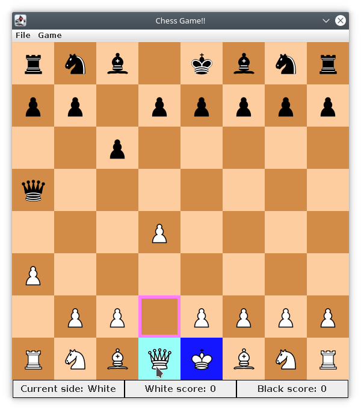

# Chess Game [](https://travis-ci.com/zli117/Chess-Game)

Chess Game as a show case for OOP design

## Features:

 * Undo move
 * Load custom board config
 * Possible moves highlighting
 * Supports En Passant, Castling etc.
 * Warning when king is under possible attack

## Interface:


## Design:

 * MVC architecture: 
   * Model: The chess board, chess rules, all the pieces. Under [model](src/main/java/model) directory.
   * View: The chess board UI, window and control widgets. Under [view](src/main/java/view) directory.
   * Controller: Bridges between model and view. Implemented in [Controller.java](src/main/java/controller/Controller.java).
 
 * OOP design patterns:
   * Factory pattern: To construct chess pieces from their string representations. Later used for 
     loading the board from a config file. Implementation is in [BoardBuilder.java](src/main/java/utils/BoardBuilder.java).
   * Command pattern: Each move is encapsulated in a command, which has the logic to undo the move. 
     Implementation is in [Command.java](src/main/java/model/Command.java).
   * Observer pattern: Observers observe the status of the game such as checkmate or stalemate. 
     Interface in [GameObserverCallBacks.java](src/main/java/model/GameObserverCallBacks.java).

## Build and Run:

 * Requires JRE and JDK version 1.8+
 * Build jar: (in root directory)
 ```bash
 chmod +x gradlew
 # Disable step by step manual test when building
 export SKIP_GUI=True
 ./gradlew build
 ```
 The resulting jar will be in `build/libs/` directory.
 
 * Run Jar:
   * `cd` into `build/libs/`.
   * Run `java -jar chess-game-1.0-SNAPSHOT.jar`
   * If needed, select custom board config in `File > Open config file` or `Ctrl-o` once game window 
     is visible. 
 
 * Run tests:
   * If you want to skip manual tests, set the env variable `SKIP_GUI=True`.
   * Execute:
   ```bash
   ./gradlew test
   ```
   * Follow instructions to perform manual tests cases.
 
## Create custom board config:

* Example board configs are: [board.conf](src/main/resources/board.conf), 
  [board_with_jumper.conf](src/main/resources/board_with_jumper.conf), and 
  [board_with_squeen.conf](src/main/resources/board_with_squeen.conf)
* The first two lines are board height and width respectively
* The third line is the board type. Currently only supports `StandardChessBoard`.
* The following lines each represents the config of a row. Each piece is comma separated. Piece 
  representation follows format: `<piece name>_<piece side>`.
