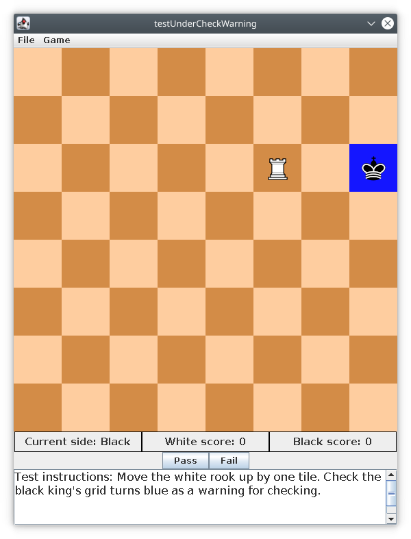
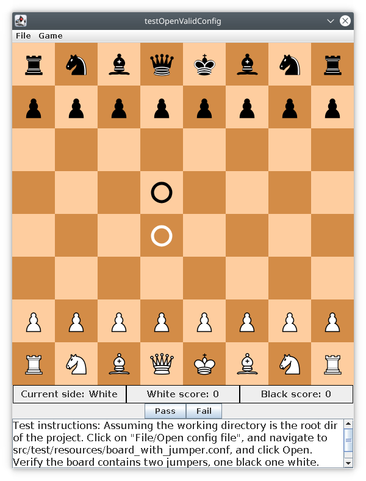
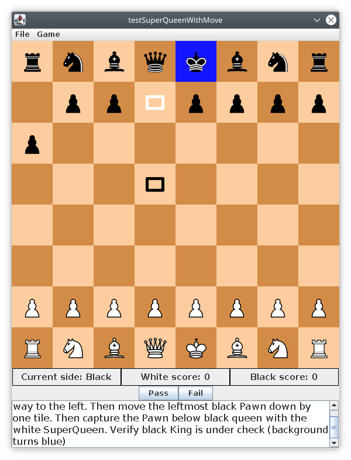
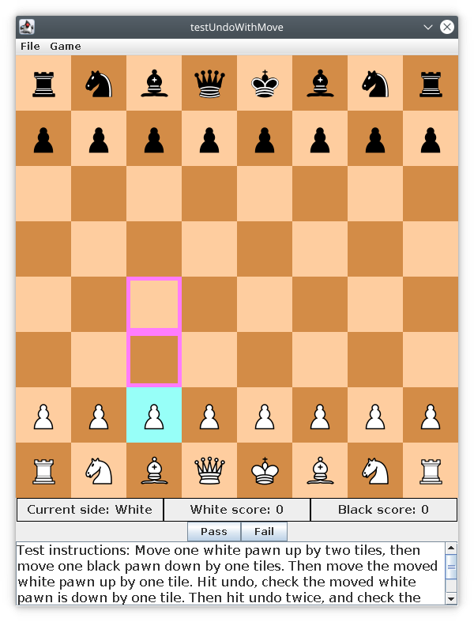
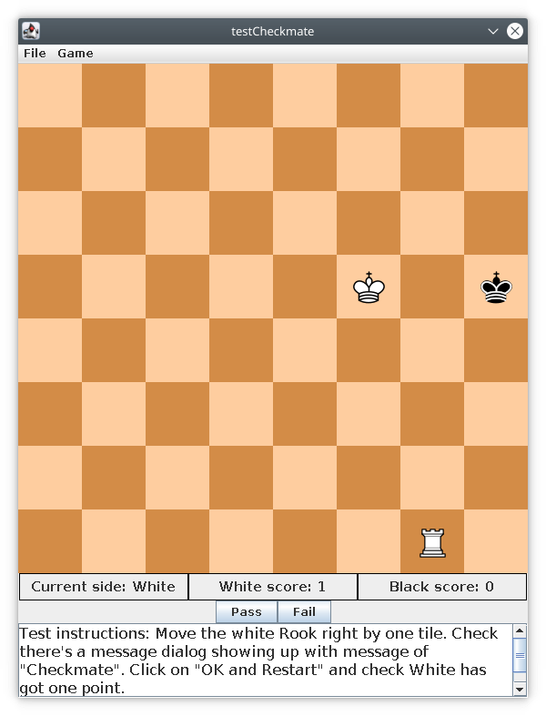

## testUndoWithoutMove
 * Test instructions: Click "Game" on menu bar, and check "Undo" is gray (disabled). Then click on any white piece and check "Undo" again, it should still be disabled.

## testStaleMate
 * Test instructions: Move the white queen up by one tile. Check there's a message dialog showing up with message of "Stalemate". Then click on "OK and Restart" and check the game has restarted with both sides' score added by 1.

## testForfeitAfterMove
 * Test instructions: First move one white pawn up by two tiles and then move one black pawn down by one tile. Observe the current side to move is White. Click "Game" menu and select forfeit or hit Ctrl-f. Then check if Black's score has increased by 1.
 
## testForfeit
 * Test instructions: Observe the current side to move is White. Click "Game" menu and select forfeit or hit Ctrl-f. Then check if Black's score has increased by 1.
 
## testRestartAfterMove
 * Test instructions: Move the white Rook up by one tile. Check the black King's tile turns blue (warning). Then hit restart in "Game" or Ctrl-r. Check both sides' score have increased by 1, and white Rook is back to original location and black King's tile is no longer blue.
 
## testJumperWithMove
 * Test instructions: Click on white jumper and move it to the right by two tiles. Next move the leftmost black pawn down by one tile. Then move the white jumper up to capture the black Bishop. Verify the black Bishop has been captured, and black King is not under check.

## testUnderCheckWarning
 * Test instructions: Move the white rook up by one tile. Check the black king's grid turns blue as a warning for checking.
 
 

## testStandardBoardWithMove
 * Test instructions: Move leftmost white pawn up by two tiles. Then verify that no white piece is allowed to move. Also verify if any black piece has legal move, it's allowed to move.

## testOpenValidConfig
 * Test instructions: Assuming the working directory is the root dir of the project. Click on "File/Open config file", and navigate to src/test/resources/board_with_jumper.conf, and click Open. Verify the board contains two jumpers, one black one white.
 
 

## testSuperQueenWithMove
 * Test instructions: Click on white super queen and move it all the way to the left. Then move the leftmost black Pawn down by one tile. Then capture the Pawn below black queen with the white SuperQueen. Verify black King is under check (background turns blue).
 
 
 
## testRestart
 * Test instructions: Hit restart in "Game" menu or use key binding of Ctrl-r. Obverse both sides' scores have increased by 1.

## testUndoWithMove
 * Test instructions: Move one white pawn up by two tiles, then move one black pawn down by one tiles. Then move the moved white pawn up by one tile. Hit undo, check the moved white pawn is down by one tile. Then hit undo twice, and check the board is the same as beginning. Then click on the moved white pawn and verify it can move up by two tiles.
 
 
 
## testCheckmate
 * Test instructions: Move the white Rook right by one tile. Check there's a message dialog showing up with message of "Checkmate". Click on "OK and Restart" and check White has got one point and the board has been restored as in the screen shot.
 
 
 
## testOpenInvalidConfig
 * Test instructions: Assuming the working directory is the root dir of the project. Click on "File/Open config file", and navigate to src/test/resources/invalid_board_1.conf, and click Open. Verify there's a dialog window showing up with message "Invalid config file". Click on "OK" the dialog should disappear and chess board is unchanged.
 