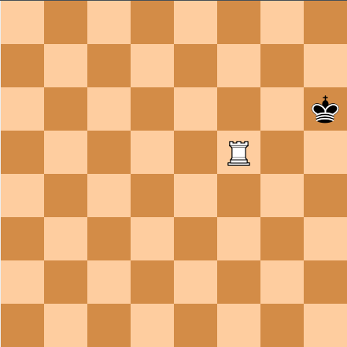
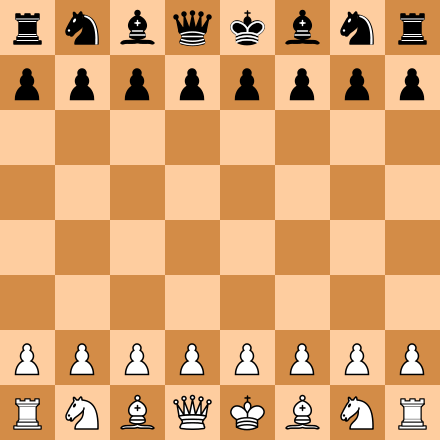

## Test Stalemate
 * Test name: testStaleMate
 * Test instructions: Click on "Enable move". The move the white queen up by one row. Check terminal has printout of "Stalemate". Click all three pieces on board, and verify that there's no move recommendation from either side.

## Test Jumper Moves
 * Test name: testJumperWithMove
 * Test instructions: Click on "Enable move". Then click on white jumper and move it to the right by two tiles. Next move the leftmost black pawn down by one tile. Then move the white jumper up to capture the black Bishop. Verify the black Bishop has been captured, and black King is not under check.

## Test Under Check Warning
 * Test name: testUnderCheckWarning
 * Test instructions: Click on "Enable move". Then move the white rook up by one tile. Check the black king's grid turns blue as a warning for checking. Verify chess board looks like following: 

## Test Display of Static Board
 * Test name: testStandardBoard
 * Test instructions: Click at all the white pawns, and verify they can move two steps. Then click at both white knights and verify there are two moves available for each. Verify the display of the board is consistent with the standard chess board as shown below. 

## Test Standard Board with Moves
 * Test name: testStandardBoardWithMove
 * Test instructions: Click "Enable move". Move leftmost white pawn up by two tiles. Then verify that no white piece is allowed to move. Also verify if any black piece has legal move, it's allowed to move.

## Test SuperQueen with Move
 * Test name: testSuperQueenWithMove
 * Test instructions: Click on "Enable move". Then click on white super queen and move it all the way to the left. Then move the leftmost black Pawn down by one tile. Then capture the Pawn below black queen with the white SuperQueen. Verify black King is under check (background turns blue).

## Test Checkmate
 * Test name: testCheckMate
 * Test instructions: Click on "Enable move". Then move the white rook right by one tile. Check terminal has the printout of "Checkmate! Black lost". Click all three pieces on board, and verify that there's no move recommendation from either side and black King is under check.

## Test Jumper Legal Moves
 * Test name: testJumper
 * Test instructions: Verify there are two jumpers on the board. One from white and another from black. Click on the white jumper, verify the move pattern corresponds to the screen shot. 

## Test SuperQueen Legal Moves
 * Test name: testSuperQueen
 * Test instructions: Verify there are two super queens on the board. One from white and another from black. Click on the white super queen, verify the move pattern corresponds to the screen shot. 